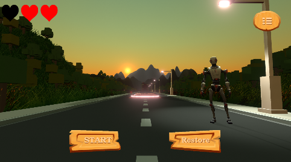
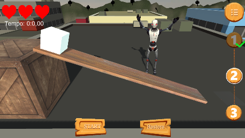
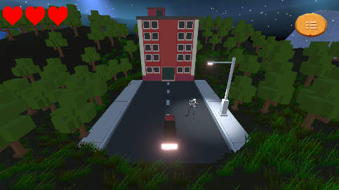

# Projeto Proativa 3D - <font color = 'red'>Loco</font>Bits

<p align = "justify">
Este projeto visa continuar o desenvolvimento de um simulador com o uso do Kinect para melhor compreensão dos assuntos abordados na disciplina de Física I nas universidades. Tendo em vista que essa é uma disciplina com altos índices de evasão e reprovação, as simulações funcionarão como material complementar aos discentes.  

O simulador irá estabelecer objetivos através de um robô interativo e de uma interface bem similar às interfaces de jogos eletrônicos, o que irá trazer o aprendizado de novos conteúdos previstos na formação dos alunos de forma didática e participativa.  Além disso, o uso de ferramentas tecnológicas em sala de aula pode representar um avanço significativo na interação de ensino e tecnologia.

Atualmente, o projeto conta com três simulações bem similares ao que se espera de uma versão final, e outras duas simulações ainda a serem aprimoradas. As simulações que já possuem um aspecto de jogo eletrônico são: Lançamento Oblíquo, Plano Inclinado e Queda Livre. As simulações que ainda precisam ser atualizadas são: Força e Massa-mola. A integração do projeto com o Kinect ainda não foi realizada.

</p>

## Simulações Encaminhadas
<div style = "display : flex">
    
    
    
</div>
<br>

## Simulações Pendentes
<div style = "display : flex">
    
    
</div>
<br>
<hr>

## Instalar

Para modificar o projeto utilize o Unity 3D versão  2020.3.1f1, que pode ser encontrado no [Unity hub](https://store.unity.com/pt/download)

## Configurando o ambiente

Clone o repositório e execute os comandos

```bash
git fetch origin develop:develop 
```

```bash
git checkout develop
```
<hr>


## Modificando o projeto

<h4>Criando conteúdo</h4>

😍 Adicione novas cenas, scripts e objetos nas nossas simulações. Depois compartilhe o que você fez !

```bash
git push origin develop
``` 

## Contribuições
Pull requests são bem vindos. Por favor, tenha certeza que o update esteja apropriados
 
 - [Jamisson Jader](https://www.instagram.com/jjader03/)
 - [Lucas Novais](https://www.instagram.com/l.novais_s/)

## Referências legais

