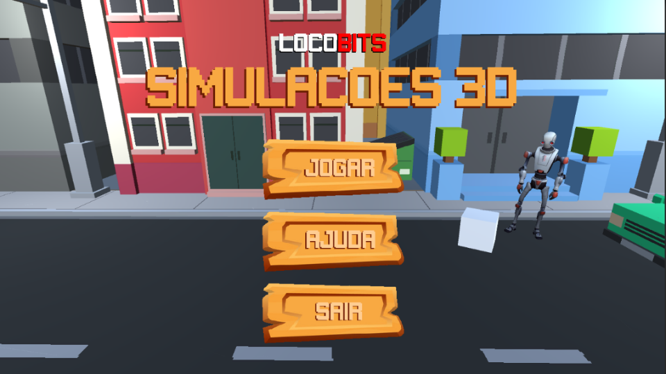
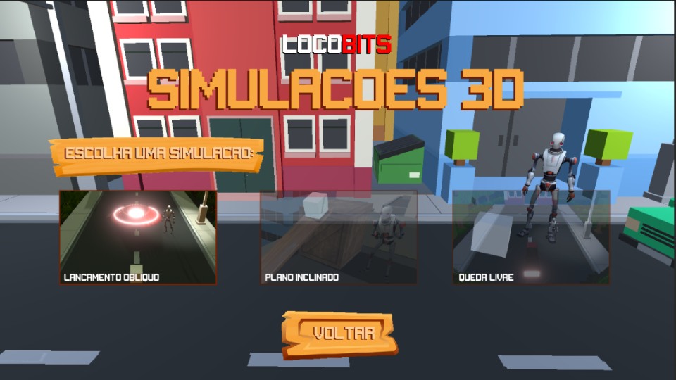
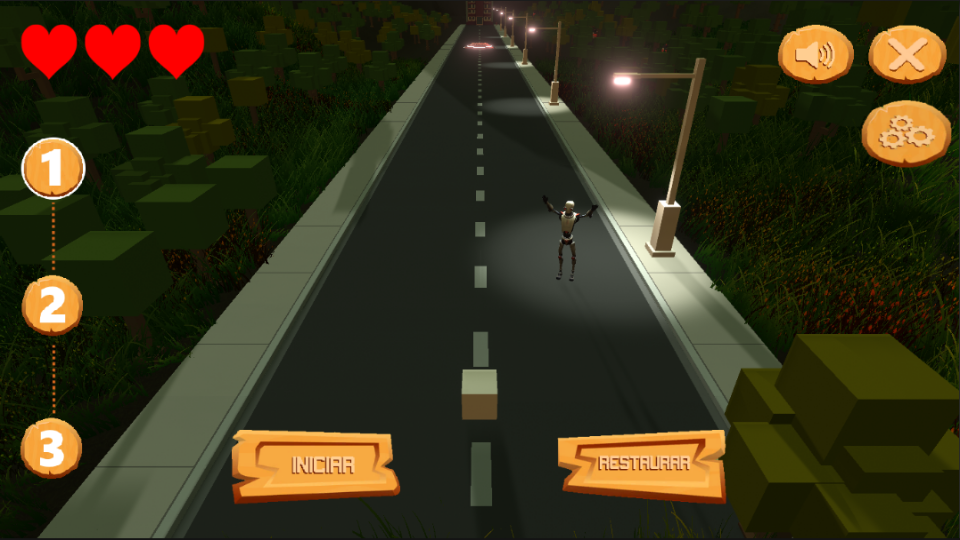
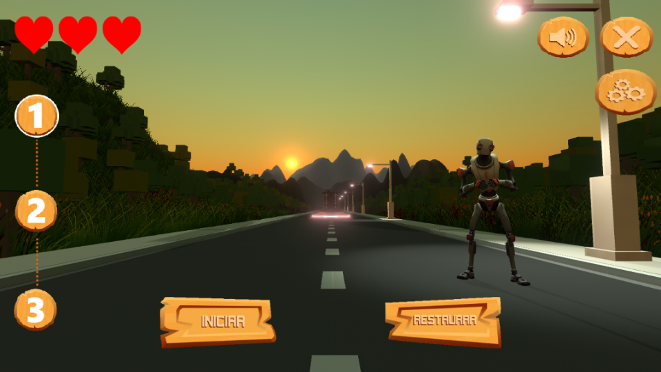
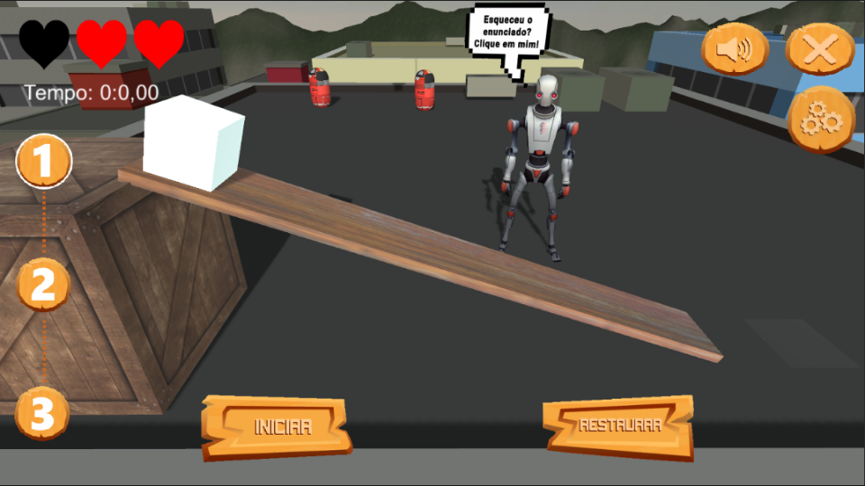
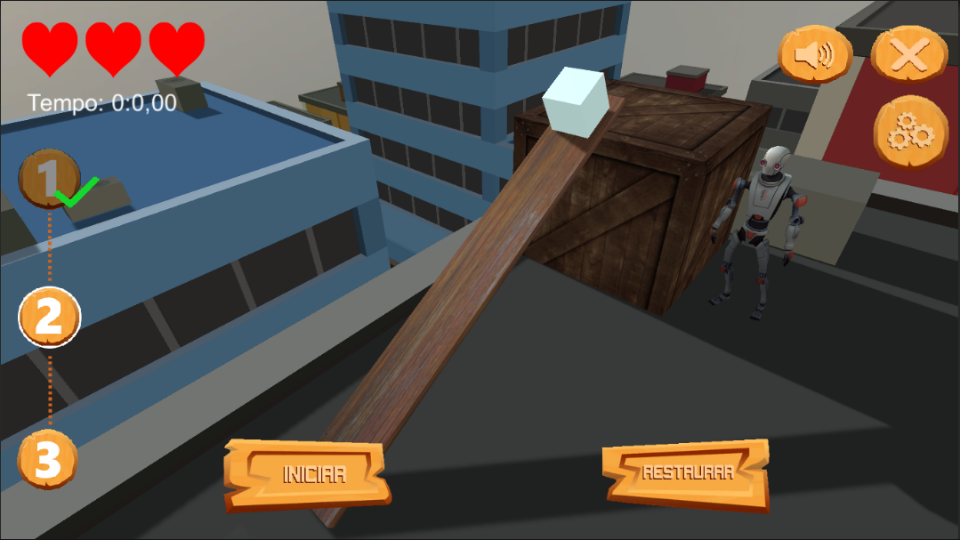
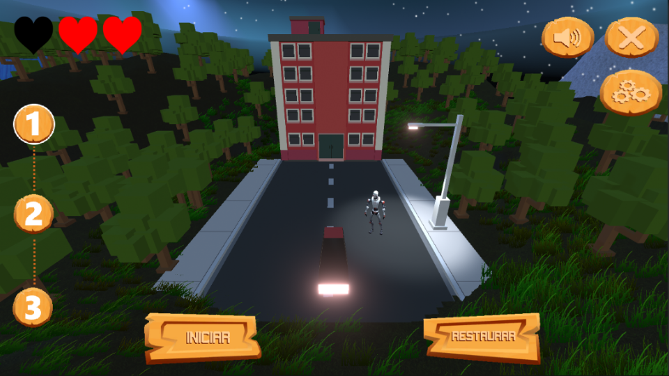
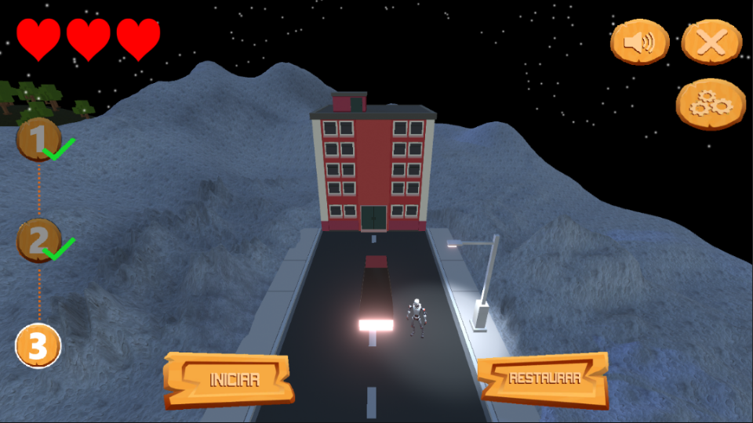

# Projeto Proativa 3D - <font color = 'red'>Loco</font>Bits

<p align = "justify">
Este projeto visa a elaboração de um simulador para aprimorar a compreensão dos assuntos abordados nas aulas de Física I em universidades. Na perspectiva de que esta é uma disciplina com altos índices de evasão e reprovação, os cenários simulados neste software funcionarão como um material complementar aos discentes.

O simulador utiliza de um robô interativo e de uma interface similar às interfaces presentes em jogos eletrônicos, para que objetivos e conceitos sejam estabelecidos ao usuário. A partir dessa implementação, se espera proporcionar um aprendizado dos conteúdos previstos na formação dos alunos de forma didática e participativa, pois as simulações implementadas funcionam como um ambiente de experimentação virtual. Ademais, o uso de ferramentas tecnológicas em sala de aula pode representar um avanço significativo na interação de ensino e tecnologia.

Atualmente, o projeto possui três simulações totalmente funcionais, e dois outros cenários com conceitos definidos, mas ainda em uma versão rudimentar. As simulações que já possuem um aspecto bem definido são: Lançamento Oblíquo, Plano Inclinado e Queda Livre. As simulações ainda pouco exploradas são: Força e Massa-mola.

A partir deste repositório, apresentaremos alguns passos que podem ser seguidos tanto para realizar a aplicação deste projeto em um contexto estudantil, quanto para implementar aprimoramentos e modificações.

</p>

## Screenshots do Software (v1.7)
### Menu Inicial
<div style = "display : flex">
    
    
</div>
<br>

### Lançamento Vertical
<div style = "display : flex">
    
    
</div>
<br>
<hr>

### Plano Inclinado
<div style = "display : flex">
    
    
</div>
<br>
<hr>

### Queda Livre
<div style = "display : flex">
    
    
</div>
<br>
<hr>

## Como utilizar as simulações

1. Você pode baixar os executáveis para Windows e Linux da versão 1.7 do nosso projeto diretamente através do link: [Simulações 3D](https://drive.google.com/file/d/1JiflgDJl4TAVmc7Qy9IEyXw3b1apnbBJ/view?usp=sharing).

2. Após efetuado o download, extraia os arquivos em qualquer lugar do seu computador.

3. Após extraidos, abra a pasta com os arquivos e entre na correspondente ao seu sistema operacional (Atualmente, suportamos Windows x86_64 e distribuições Linux Debian x86_64).

4. Para executar as simulações, abra o arquivo `Simulações 3D.exe` (Windows), ou `Linux_v1.7.x86_64` (Linux).

## Como realizar modificações

Para modificar o projeto utilize o Unity 3D versão 2020.3.1f1, que pode ser encontrado no [Unity hub](https://store.unity.com/pt/download)

1. Clone o repositório e execute os comandos

```bash
git fetch origin develop:develop 
```

```bash
git checkout develop
```

2. Ao adicionar novas cenas, scripts e objetos nas nossas simulações, pull requests serão bem vindos! 

3. Em caso de dúvidas, basta seguir a [Documentação do GitHub](https://docs.github.com/pt/github/collaborating-with-pull-requests/proposing-changes-to-your-work-with-pull-requests/creating-a-pull-request) para criar uma pull request e contribuir com o nosso projeto.

## Contribuições

 - [LocoBots] (https://www.instagram.com/locobots.ufop/)
 - [Jamisson Jader](https://www.instagram.com/jjader03/)
 - [Lucas Novais](https://www.instagram.com/l.novais_s/)
 - [Sávio Lacerda](https://www.instagram.com/savioslacerda/)

## Citações

Serão colocadas no topo desse README após a conclusão do artigo.

## Referências legais

Serão colocadas nesta seção após a conclusão do artigo.